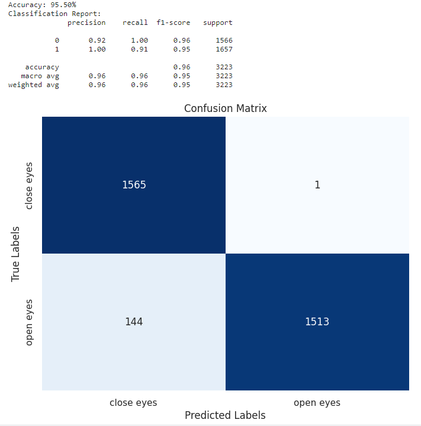
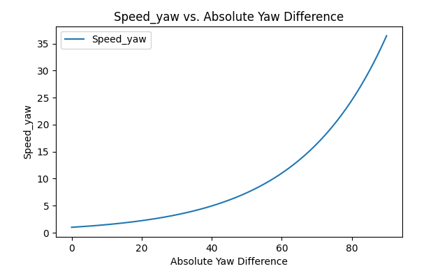
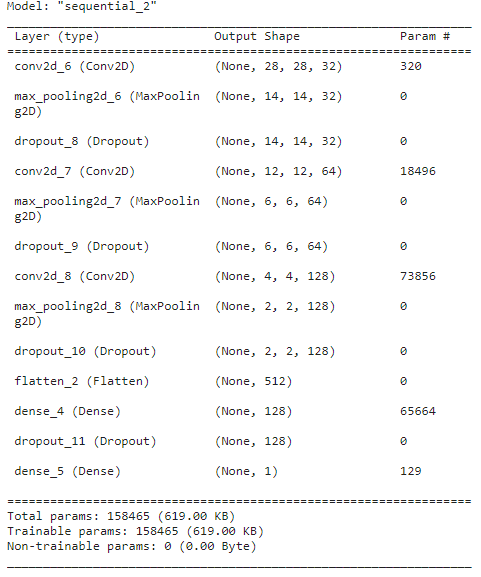
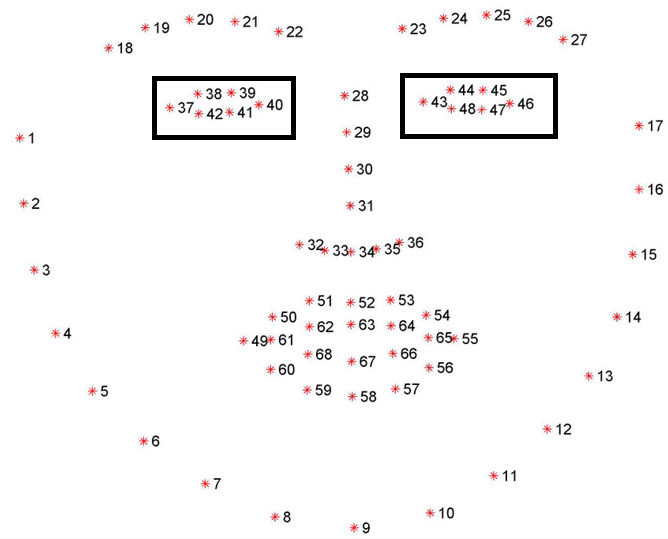
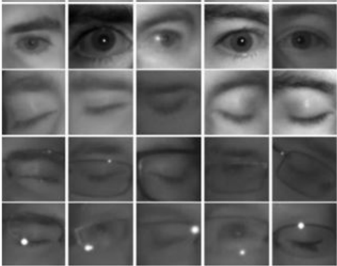

# Headpose-mouse
headpose-mouse

# How to Use
1. Position yourself in front of your laptop camera. You will see a circle appear, indicating that you are centered and the mouse will remain still.
2. Rotate your face up, down, left, or right to move the mouse cursor in that direction.
3. Slowly blink your eyes twice to perform a left-click.

# install pip packages
cd research_project
pip install -r requirements.txt

# Dependancies
1. Windows 10 - Version	10.0.19045 Build 19045
2. Python 3.9.13
3. opencv-python 4.9.0.80
4. tensorflow==2.10.0
5. cudnn-windows-x86_64-8.9.6.50
6. CUDA 11 windows
8. 3DDFA_V2 - pretrained model

# Models
* Pretrained 3DDFA_V2 model
* Custom-trained CNN model for eye open/close detection

# Dataset
### Eyes blinking
* mrlEyes dataset - http://mrl.cs.vsb.cz/eyedataset

# Information

